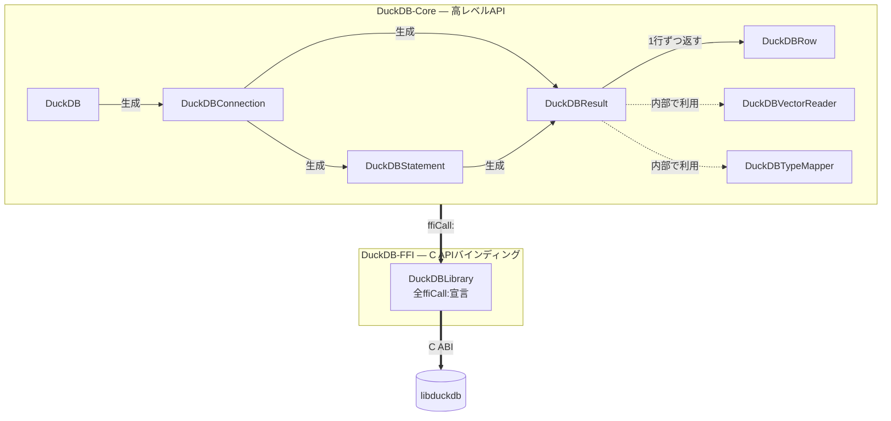
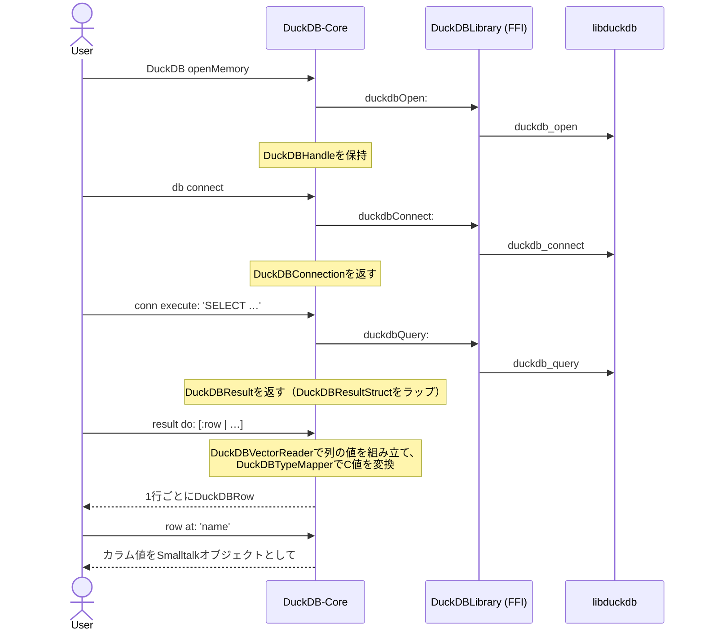
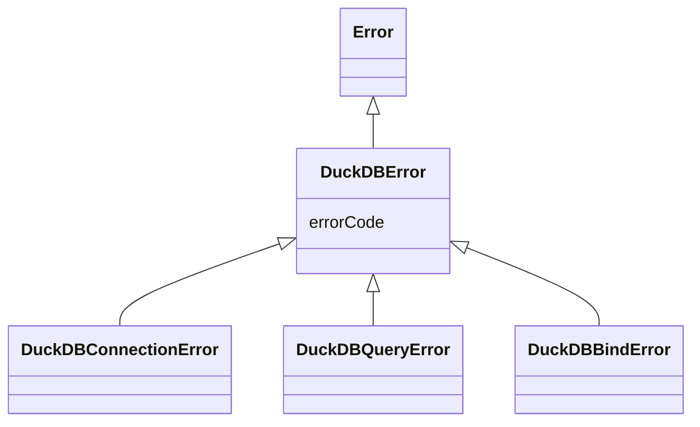

# アーキテクチャ

[English](architecture.md) | 日本語

UFFIを使ったPharo向けのDuckDBクライアントです。

C APIを薄くラップするFFI層と、その上にSmalltalkらしいAPIを提供するCore層に分かれています。

## 設計思想

次の4点を指針にしています。

- **FFI層はC APIの薄いラッパーに徹する** — 1メソッドが1つのC関数に対応し、ロジックを持ちません。そのため`duckdb.h`と1対1で見比べられ、もし誤りがあってもこの層の中で見つかります。値の判断や加工は、テストしやすいSmalltalk側（Core層）に置きます。
- **Core層がC APIをカプセル化する** — ユーザーが扱うのは普通のSmalltalkオブジェクトだけで、ポインタやC型は表に出しません。結果はコレクションのように列挙でき（`do:`・`collect:`）、失敗時は例外（`DuckDBError`）が送出されます。
- **リソースは所有者が明示的に解放する** — ライフサイクルを握るのはDuckDB（C側）です。そこでSmalltalk側もGC任せにせず、開いたオブジェクトが対応するリソースを保持し、`close` / `disconnect` / `destroy`で自分の手で解放します。
- **依存は上位層から下位層への一方向** — `DuckDB-Core`がその下の`DuckDB-FFI`を使い、`DuckDB-FFI`が`libduckdb`を呼びます。逆向きの依存がないので、各層を切り離してテストでき、変更の影響もその層にとどまります。

## パッケージ構成

- **`DuckDB-Core`** — ユーザー向けの高レベルAPI
- **`DuckDB-FFI`** — C APIの薄いラッパー（`ffiCall:`宣言のみ）
- **`BaselineOfDuckDB`** — Metacelloのロード定義（依存とロード順）
- **`DuckDB-Tests`** — SUnitテスト

## クラスの関係

どのクラスがどの層に属し、実行時にどの順でオブジェクトを生成していくかを示します。矢印の意味は、**実線＝生成する**、**点線＝内部で利用する**、**太線＝層をまたいで呼び出す**です。

## 主要なクラス

おおまかに使う順に並べています。各クラスの詳しい説明はSystem Browser上のクラスコメントにあります。

1. **`DuckDB`** — 入り口。データベースを開き（`openMemory` / `open:`）、接続を作り（`connect`）、閉じます（`close`）。
2. **`DuckDBConnection`** — `execute:`でSQLを実行し、`prepare:`でプリペアドステートメントを作ります。
3. **`DuckDBResult`・`DuckDBRow`** — 結果を列挙し（`do:`・`collect:`・`select:`）、行からカラムを取り出します（`at:`）。
4. **`DuckDBStatement`** — パラメータをバインドして実行します（`bind…:at:`・`execute`）。
5. **`DuckDBVectorReader`・`DuckDBTypeMapper`** — 内部用。データチャンクから値を取り出し、C型をSmalltalkオブジェクトに変換します（ネストしたLIST / STRUCT / MAP、ENUM、UUID、TIMESTAMP_TZにも対応）。
6. **`DuckDBLibrary`** — DuckDBのC関数を`ffiCall:`として宣言する最下層。ハンドルや構造体もここにあります。

## クエリ実行フロー

データベースを開いてから結果を1行ずつ取り出すまで、1つのクエリの流れを示します。

プリペアドステートメントも流れは同じです。`conn prepare:`が`DuckDBStatement`（`DuckDBPreparedHandle`を保持）を返し、`bind…:at:`と`execute`が`DuckDBLibrary`を通って`DuckDBResult`を作ります。

## FFIの規約

`DuckDB-FFI`のメソッドを書くときの決まりです。

- メソッド名はC関数名をキャメルケースにします（`duckdb_open`なら`duckdbOpen:`）
- `ffiCall:`メソッドはすべて`'ffi - …'`プロトコルにまとめます

## メモリ管理

DuckDBのC APIでは、リソースを解放する責任が呼び出し側にあります。そこで、リソースを持つクラスが自分で明示的に解放し、結果とステートメントは呼び出し側が`ensure:`ブロックの中で解放するようにしています。

| Cリソース | 解放するメソッド | 所有者 |
|-----------|----------------|--------|
| `duckdb_database` | `DuckDB>>close` | `DuckDB` |
| `duckdb_connection` | `DuckDBConnection>>disconnect` | `DuckDBConnection` |
| `duckdb_result` | `DuckDBResult>>destroy` | `DuckDBResult`（呼び出し側が`ensure:`で呼ぶ） |
| `duckdb_prepared_statement` | `DuckDBStatement>>destroy` | `DuckDBStatement` |

`autoRelease`は使いません。DuckDBが所有するオブジェクトにこれを付けると、PharoのGCとDuckDB側のライフサイクルがぶつかってしまうためです。

## エラークラス

すべてのエラーは`DuckDBError`のサブクラスです（`DuckDBError`は`errorCode`を持ちます）。

- **`DuckDBConnectionError`** — `open`・`connect`の失敗
- **`DuckDBQueryError`** — SQL実行の失敗
- **`DuckDBBindError`** — パラメータバインドの失敗

ライブラリのエラーをまとめて扱いたいときは`DuckDBError`で捕捉します。特定のエラーだけ扱いたいときは、そのサブクラスで捕捉します。
