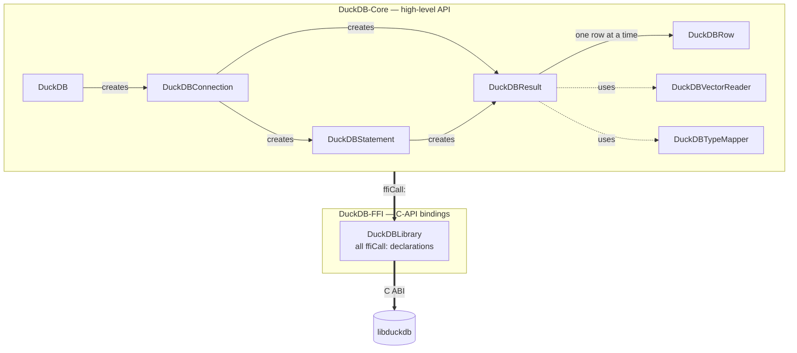
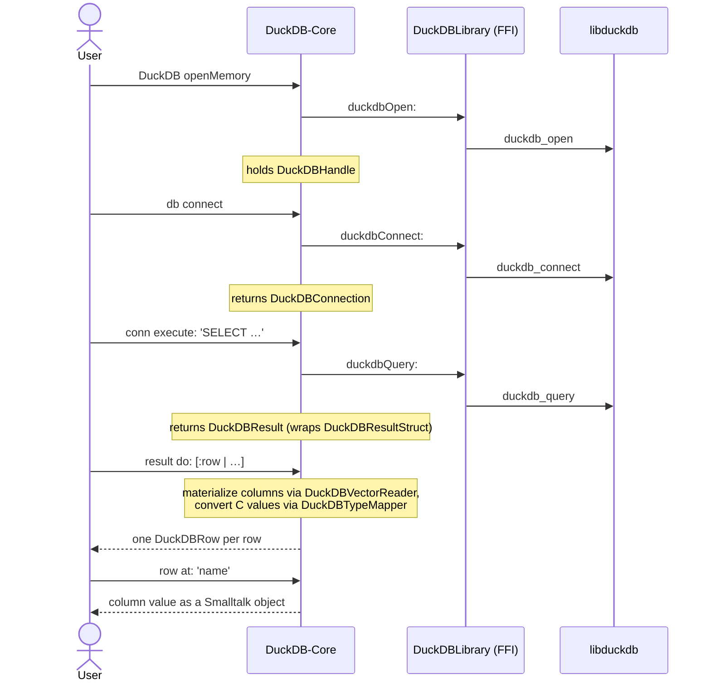
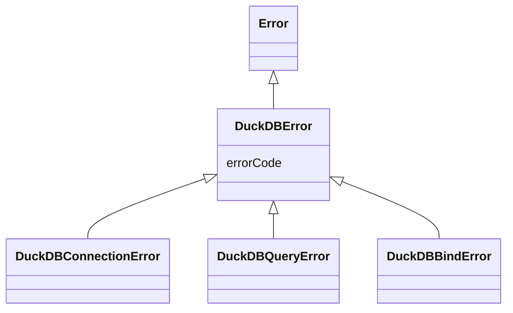

# Architecture

English | [日本語](architecture.ja.md)

A Pharo client for DuckDB built on UFFI. It is split into a thin FFI layer that
wraps the C API directly, and a Core layer that provides an idiomatic Smalltalk API
on top.

## Design philosophy

Four principles guide the design:

- **The FFI layer is a thin wrapper over the C API** — one method maps to one C
  function and carries no logic, so it can be checked one-to-one against `duckdb.h`
  and any mistake stays inside this layer. Decisions and data shaping live in the
  Smalltalk side (Core), where they are easy to test.
- **The Core layer encapsulates the C API** — users only ever work with ordinary
  Smalltalk objects; pointers and C types never surface. Results iterate like
  collections (`do:`, `collect:`) and failures are raised as exceptions (`DuckDBError`).
- **Resource ownership is explicit** — DuckDB (the C side) owns the lifecycle, so the
  Smalltalk side does not leave it to the GC: the object that opens a resource holds
  it and frees it by hand via `close` / `disconnect` / `destroy`.
- **Dependencies point downward only** — `DuckDB-Core` uses `DuckDB-FFI` beneath it,
  which calls `libduckdb`; nothing depends upward, so each layer can be tested in
  isolation and a change stays contained within its layer.

## Packages

- **`DuckDB-Core`** — the high-level API users work with
- **`DuckDB-FFI`** — the thin C-API wrapper (`ffiCall:` declarations only)
- **`BaselineOfDuckDB`** — Metacello load definition (dependencies and load order)
- **`DuckDB-Tests`** — SUnit tests

## Class relationships

Which class lives in which layer, and the order in which objects are created at
runtime. Arrows mean: **solid = creates**, **dotted = used internally**,
**bold = cross-layer call**.

Each user-facing Core class (`DuckDB` / `DuckDBConnection` / `DuckDBStatement` /
`DuckDBResult`) holds the matching C resource and is responsible for releasing it
(see [Memory management](#memory-management)). Those resources — left out of the
diagram to keep it readable — are the FFI handles (`DuckDBHandle`,
`DuckDBConnectionHandle`, `DuckDBPreparedHandle`) and structs (`DuckDBResultStruct`,
etc.).

## Key classes

Listed roughly in the order you use them; each class has a class comment in the
System Browser with the detail.

1. **`DuckDB`** — the entry point: open a database (`openMemory` / `open:`), get a connection (`connect`), close it (`close`).
2. **`DuckDBConnection`** — runs SQL with `execute:` and builds prepared statements with `prepare:`.
3. **`DuckDBResult` / `DuckDBRow`** — iterate results (`do:`, `collect:`, `select:`) and read a row's columns (`at:`).
4. **`DuckDBStatement`** — bind parameters and run (`bind…:at:`, `execute`).
5. **`DuckDBVectorReader` / `DuckDBTypeMapper`** — internal: read values out of data chunks and convert C types to Smalltalk objects (including nested LIST / STRUCT / MAP, ENUM, UUID, TIMESTAMP_TZ).
6. **`DuckDBLibrary`** — the bottom layer that declares every DuckDB C function as a `ffiCall:`; the handles and structs live here too.

## Query execution flow

The flow of one query, from opening the database to iterating its rows.

Prepared statements follow the same shape: `conn prepare:` returns a
`DuckDBStatement` (holding a `DuckDBPreparedHandle`); `bind…:at:` and `execute`
call through `DuckDBLibrary`, producing a `DuckDBResult`.

## FFI conventions

Rules for writing `DuckDB-FFI` methods:

- Method names are the C function names in camelCase (`duckdb_open` becomes `duckdbOpen:`).
- Every `ffiCall:` method lives under a `'ffi - …'` protocol.

## Memory management

The DuckDB C API makes the caller responsible for freeing resources. Each owning
class releases its resource explicitly; results and statements must be released by
the caller, normally inside an `ensure:` block.

| C resource | Released by | Owner |
|------------|-------------|-------|
| `duckdb_database` | `DuckDB>>close` | `DuckDB` |
| `duckdb_connection` | `DuckDBConnection>>disconnect` | `DuckDBConnection` |
| `duckdb_result` | `DuckDBResult>>destroy` | `DuckDBResult` (caller calls it via `ensure:`) |
| `duckdb_prepared_statement` | `DuckDBStatement>>destroy` | `DuckDBStatement` |

`autoRelease` is **not** used: applying it to objects DuckDB owns would let Pharo's
GC race with DuckDB's own lifecycle.

## Error classes

Every error is a subclass of `DuckDBError` (which carries an `errorCode`).

- **`DuckDBConnectionError`** — open / connect failed
- **`DuckDBQueryError`** — SQL execution failed
- **`DuckDBBindError`** — parameter binding failed

Catch `DuckDBError` to handle every failure from the library; catch a specific
subclass to handle only that case.
